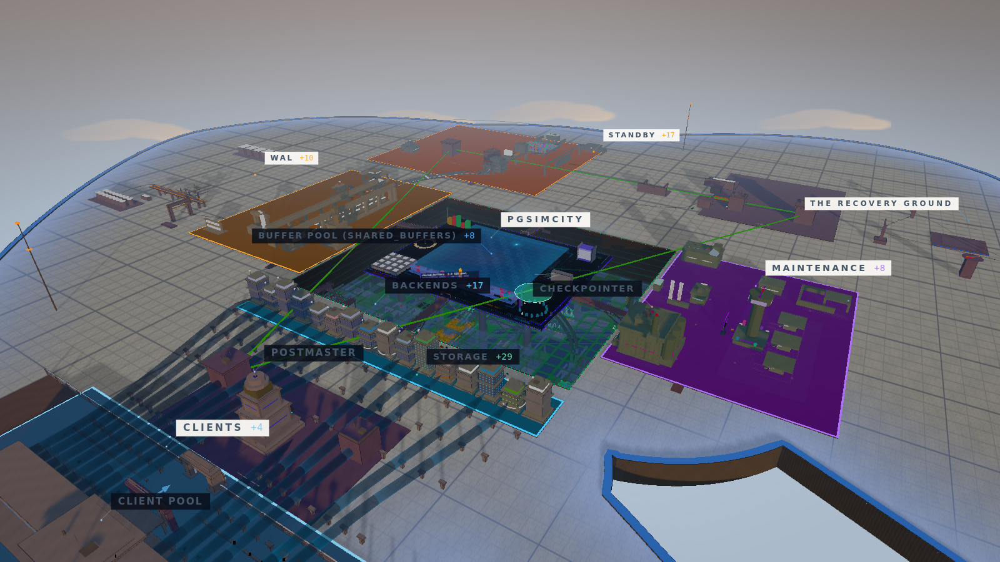

# SSDSimCity

**Walk through a modern SSD. Break things. Understand why.**

An explorable 3D city where buildings represent multi-queue SSD internals and
motion shows their interaction. Follow one I/O request from a host submission
queue through the FTL into NAND, investigate why writes suddenly stall when
garbage collection starts, and see what changes when the write cache, mapping
table, and flash channels become bottlenecks. Modeled on MQSim (FAST 2018).

**[Explore the SSD city](https://yisun219.github.io/ssdsimcity/)** ·
[Start an investigation](#start-here-investigate-a-vacuum-blockade)

No installation. Runs in a browser with WebGL2.

[](https://yisun219.github.io/ssdsimcity/)

[Featured in InfoQ · IBM Think · Gizmodo · GIGAZINE](#press-coverage)

## Start here: investigate a vacuum blockade

**A table keeps growing even though autovacuum is running. Why?**

1. [Open the SSD city](https://yisun219.github.io/ssdsimcity/) and choose **Investigate**.
   This starts the guided vacuum-blockade case.
2. Inspect and record the table, worker, snapshot and application-owner evidence.
   Explain what prevents cleanup before choosing an intervention.
3. End the transaction that the case establishes as abandoned, then check whether
   vacuum actually reclaims row versions. Releasing a snapshot is not itself cleanup.
4. Choose **Inspect a page and its row versions** to connect the investigation
   to the page layout, tuple header and snapshot diagrams.

Pause when you need time to read. Try challenge mode afterward for less guidance.
Evidence and notes belong to the current attempt; they do not survive a reload.

## Choose your view

| Experience | What you can do |
|---|---|
| **[City](https://yisun219.github.io/ssdsimcity/)** | Explore the engine spatially, follow the guided tour and investigate a vacuum incident. |
| **[Diagnose](https://yisun219.github.io/ssdsimcity/observability/)** | Follow a query’s path and inspect the simulation through a 2D diagnostic interface. |
| **[Machine](https://yisun219.github.io/ssdsimcity/machine/)** | Run real SQL with opt-in PGlite beside a 2D architecture board; measured and modeled values are labeled separately. |

## How much to trust this

**The city is a model, not a real SSD.** Its numbers and timing are scaled to
make internals observable. The host side targets the PostgreSQL 18 major line;
the device follows the MQSim FAST 2018 paper — Tavakkol et al., "MQSim: A
Framework for Enabling Realistic Studies of Modern Multi-Queue SSD Devices" —
at teaching scale; it is not a cycle-accurate simulator and does not benchmark
hardware.

> The host issues large sequential sweeps; the city models PostgreSQL 18's bulk-read strategy with a fixed 32-frame ring so one big scan cannot evict the whole buffer pool. The device below serves whatever the host sends it.

The project is an evolving 0.x prototype, with known simplifications. See
[model accuracy and limitations](docs/MODEL-ACCURACY.md) for formulas and
disclosures. [Report an SSD mismatch](https://github.com/yisun219/ssdsimcity/issues/new).

Four review rounds shaped the current text. The device model follows
MQSim's published configuration (REL_18_STABLE is the PostgreSQL source branch
the host-side claims were checked against). Lessons include keyboard and
text-first routes; the 3D scene and first-person walk do not have a nonvisual
equivalent. Touch verification has used browser emulation, not physical
devices. [Accessibility and alternatives](ACCESSIBILITY.md).

---

## Press coverage

**Featured in InfoQ, IBM Think, Gizmodo and GIGAZINE.**

Selected reporting and hands-on reviews of the upstream PostgreSQL city (PGSimCity), whose engine this city inherits:

| Publication | Article | Published |
|---|---|---|
| **InfoQ** | [How the upstream PGSimCity Turns PostgreSQL Complexity into a Virtual City 3D Simulation](https://www.infoq.com/news/2026/08/pgsimcity/) — Olimpiu Pop on the project’s architecture and educational approach. Also available in [简体中文](https://www.infoq.cn/article/umVdo2GaEyONQLWNmPZ9), translated by 田橙. | August 16, 2026 |
| **IBM Think** | [Someone turned PostgreSQL into a city you can walk around in](https://www.ibm.com/think/news/pgsimcity-postgresql-3d-visualization) — Antonia Davison’s feature, also included in the IBM Think newsletter. | July 31, 2026 |
| **Gizmodo** | [This SimCity-Like Visualization Turns Tech’s Most Boring Systems Into Fun](https://gizmodo.com/this-simcity-like-visualization-turns-techs-most-boring-systems-into-fun-2000791397) — Tom Hawking’s hands-on review. | July 28, 2026 |
| **GIGAZINE** | [データベース「PostgreSQL」がどのように実際には内部で動いているかがシムシティっぽい3Dでわかる「PGSimCity」](https://gigazine.net/news/20260728-pgsimcity-postgresql/) — a screenshot-led Japanese walkthrough of connections, query planning, buffers, page storage, WAL, vacuum and replication. [English edition](https://gigazine.net/gsc_news/en/20260728-pgsimcity-postgresql/). | July 28, 2026 |

### Further reading

- **Clement Mondary · Français:** [PGSIMCITY : comprendre PostgreSQL en visitant une ville en 3D](https://mondary.design/2026/08/pgsimcity-comprendre-postgresql-en-visitant-une-ville-en-3d/) — an introduction to the city’s visual language, interactive scenarios and distinction between the simulation and PGlite.

Articles describe the version available when published.

---

## What you are looking at

| District | What it is |
|---|---|
| **Client sky** (north, above) | Connections arriving from the application tier |
| **Postmaster** | The supervisor. Forks one backend per connection and never touches your data |
| **Backend row** | 16 backend processes. Their lighting *is* their state — including `idle in transaction` |
| **Buffer pool (`shared_buffers`)** | Up to 1,024 representative frames (256 active at the 2 GiB model default; PostgreSQL 18 defaults to 128 MiB), beside `wal_buffers`, the ProcArray, lock table, CLOG and buffer mapping table |
| **The excavation** | The data directory: where memory ends and storage begins |
| **Storage** (below) | Heap files as fields of 8 KiB pages, B-trees as actual trees, TOAST, the FSM and visibility map, the OS page cache and the disks |
| **WAL district** (east) | Backends and walwriter write WAL into `pg_wal`; the archiver copies completed segments, while walsenders independently stream WAL as it is generated |
| **Maintenance yard** (west) | Checkpointer, background writer, autovacuum launcher and its workers |
| **Standbys** (south) | Two independent walreceivers, startup processes replaying WAL, and the lag on each stream |
| **Continuity quarter** (outer east and south) | WAL archive, base backups, point-in-time recovery, delayed replay, leader lease and rejoin machinery |
| **Query lab** (above the backends) | Select a backend and its statement unfolds: parse → rewrite → plan → execute |

Colour is semantic everywhere and never decorative: **WAL is amber**, **dirty
pages are red**, **clean pages are blue**, **vacuum is violet**, **checkpoints
are pink**, **the background writer is teal**, **replication is orange**,
**storage is green**, **indexes are aqua**, **locks are red**.

---

## More things to try

- Press **`T`** for the guided tour. It follows one I/O request from a host
  submission queue through the FTL into NAND, and shows what garbage collection
  does to the flows sharing the device.
- Press **`Enter`** to trace one request. Pick **Random write** and slow
  playback exposes the seven end-to-end stages: enqueue, PCIe, FTL, cache,
  flash, ONFI and the completion path.
- Run **Cache thrash** from the Scenarios menu. It drops the device DRAM data
  cache to 16 MiB under a deep-queue writer: evictions fire before destaging
  completes, flash write traffic multiplies, and the low-intensity flow sharing
  the cache pays for it.
- Run **Checkpoint storm**. It shrinks the overprovisioning reserve so the
  free-page pool falls through the GC threshold within seconds; watch valid-page
  copies and erases stall user reads on the same die.
- Run **The CMT cliff**. A random flow's mapping misses evict a sequential
  flow's translation entries; watch the CMT hit ratio fall and mapping reads
  stretch the sequential flow's latency.
- Turn off **Preemptible GC** and watch erases run to completion while user
  reads queue behind them — then switch it back and watch suspension/resume.
- Set **Data cache** high and **Random share** low and watch the write cache
  absorb nearly every write; then push the mix random and watch destage
  pressure climb.
- Turn on **Long-running transaction** to pin the host-side write set: the FTL
  keeps allocating fresh pages for rewritten LPAs and the free-page pool sinks
  faster. Release it and GC has stable victims to reclaim.
- Set **`synchronous_commit`** to `off` and watch backends stop waiting for the
  host-side durability point. Then read what you just traded away.
- Turn on **Slow replay** and watch one flow's queue depth pull away from the
  other's while the device serves both.
- Press **`G`** and walk through the city at eye level. A NAND block that read
  as one tile from the establishing shot becomes a structure above your head.
- Try an operator scenario, wait for its decision, and choose a response. Slot
  pressure and the vacuum-blockade analog make the consequence visible and
  offer a safe reset.

---

## Controls

Start with **drag** to pan, **wheel/pinch** to zoom, **T** for the tour,
**K** to pause and **H** to return to the overview.

<details>
<summary>All camera controls and keyboard shortcuts</summary>

Press **`?`** in the city for the city control map and colour legend.

### Camera

| Input | Action |
|---|---|
| Left-drag | Pan in orbit mode — grab the ground and move it, the way a map does |
| `Shift`-left-drag or `Ctrl`/`Cmd`-left-drag | Orbit around the city |
| Middle-drag | Pan in orbit mode |
| Right-click or touch long-press | Open the context menu |
| Wheel | Zoom towards the cursor in orbit mode · adjust movement speed in fly mode |
| 1 finger | Pan in orbit mode |
| 2 fingers | Pinch to zoom · twist to orbit · drag both up/down to tilt |
| First-person touch | Left thumb moves · right thumb looks · buttons jump and crouch (rise and dive while swimming) |
| Click | Select a building · in fly or walk mode, capture the mouse for looking |
| Double-click | Focus a component — semantic focus instead of a map-style zoom step |
| `W` `A` `S` `D` or the arrow keys | Move |
| `Shift` + left/right arrow | Turn left/right in orbit, fly, or walk mode |
| `Shift` + up/down arrow | Tilt or look up/down in orbit, fly, or walk mode |
| `+` / `-` | Zoom in/out in orbit mode |
| `Space` or `E` · `C` or `Q` | Rise · descend in fly mode; in walk mode, `Space` jumps, `E` operates nearby levers, doors, or consoles, and `C` crouches |
| `PageUp` / `PageDown` | Change altitude in orbit or fly mode |
| `Shift` · `Alt` | Boost · precision in orbit or fly mode; `Shift` runs in walk mode |
| `Esc` | Leave pointer lock |

### Keys

| Key | Action |
|---|---|
| `F` | Toggle fly / orbit camera |
| `G` | Get down and walk the city on foot, 1.7 m tall |
| `H` | Back to the establishing shot |
| `Home` | Back to the default establishing shot |
| `O` | Straight-down overview of the whole plate |
| `T` | Guided tour — the core query and maintenance path in 14 chapters |
| `Enter` | Open Run a Query |
| `/` or `Ctrl/Cmd+K` | Command palette — search every component, setting and scenario |
| `?` | Keyboard map and colour legend |
| `L` | Toggle the floating labels |
| `N` | Cycle night / afternoon daylight / approximate local-time light |
| `M` | Toggle walk sound |
| `K` or `P` | Pause / resume |
| Focus **+0.1 model s**, then `Enter` | Advance the paused workload by 0.1 model seconds; remain paused |
| `,` `.` | Slower / faster (0.1× – 5×) |
| `R` | Reset to the default settings |
| `Esc` | Close the topmost overlay |
| `1` – `8` | Jump to a district: clients, backends, buffer pool, WAL, storage, query lab, maintenance, standby |

---

</details>

## How it is built

```text
src/
  core/           shared contracts, event bus, registry, themes and utilities
  sim/            the PostgreSQL simulation
  world/          the city geometry, one module per district
  engine/         renderer, camera, flows, labels, picking, collision and audio
  ui/             controls, inspector, tour, search and written explanations
  observability/  a separate diagnostic interface over the same simulation
machine/           a separate psql workbench and 2D architecture board
```

Three rules hold it together:

1. **`world/layout.ts` is the single source of truth for geography.** Anchors,
   table definitions and the route network live there. No district hard-codes a
   coordinate another district needs.
2. **The simulation never imports three.js, and the world never mutates the
   simulation.** They meet at `SimState`.
3. **Rendering carries meaning differently by theme.** At night structure is
   matte and meaning is neon; in daylight hue and value carry meaning without
   relying on bloom. Local-time light follows an approximate 06:00–18:00 path
   from the reader's clock; it uses neither geolocation nor an astronomical
   latitude/season model.

Stack: [three.js](https://threejs.org) r185, TypeScript, Vite. three.js is the
3D application's only bundled runtime dependency. The separate 2D Query flow
and Machine may lazy-load PGlite after reader opt-in. There is no framework,
and Plausible analytics is the sole external service.

`window.SSDSIMCITY` in the browser console includes `sim`, `registry`, `bus`,
`rig`, `gfx` and `flows` if you would rather drive the city from the outside.
For formulas, review history and known simplifications, see
[Model accuracy and limitations](docs/MODEL-ACCURACY.md). Each inspector names
material simplifications at the point where they matter.

### Real PostgreSQL beside the model

The [accuracy boundary](docs/MODEL-ACCURACY.md) makes internals
such as the clock sweep's frame-by-frame victim choice observable. The separate
Query flow and the [Machine](https://yisun219.github.io/ssdsimcity/machine/) offer opt-in PGlite modes: real PostgreSQL
supplies parsing, plans, catalogs, buffer counters, errors and results, while the
visual model supplies the otherwise hidden interior. Each surface labels those
sources separately because PostgreSQL exposes the former and not the latter.

---

## Run it locally

You need Node.js `^20.19.0 || >=22.12.0` and a browser with WebGL2.

```bash
npm install
npm run dev      # http://localhost:5173
```

```bash
npm test
npm run typecheck
npm run build    # static bundle in dist/
npm run preview  # http://localhost:4173
```

There is no application server. The result is a static bundle. The 3D city and
Diagnose model path make only the analytics requests described below. Query flow
and the Machine may, after an explicit click or first submitted query, load the
same-origin PGlite JavaScript, data and WebAssembly assets and run an in-memory
PostgreSQL in the browser. Their model paths continue to work when analytics or
PGlite is blocked.

**Analytics and privacy.** SSDSimCity uses
[Plausible](https://plausible.io/) for aggregate, cookie-free analytics on the
city, observability, and Machine pages. It records pageviews, unique visitors,
referring sites, bounce rate, visit duration and interactions such as starting
the tour, changing playback, opening a panel, tracing a statement, selecting a
building or following an outbound link. SSDSimCity sends no names, email addresses,
free-form input, browser fingerprint or application-supplied personal data, and
creates no analytics cookies, analytics local storage, advertising identifier
or session recording. Blocking `plausible.io` stops measurement without
affecting the application.

---

## Roadmap

Follow the [living delivery roadmap](https://github.com/NikolayS/PGSimCity/issues/10)
for current milestones and the [technical roadmap](ROADMAP.md) for longer-term
direction. See [releases](https://github.com/NikolayS/PGSimCity/releases) for what
is actually shipped.

## Licence

SSDSimCity is an independent, non-commercial educational visualization of
PostgreSQL internals. It is not affiliated with, sponsored, endorsed, or
approved by Electronic Arts Inc. SimCity is a trademark of Electronic Arts Inc.
This project contains no SimCity code, assets, artwork, logos, characters,
audio, or game content.

[Apache-2.0](LICENSE). Copyright 2026 Nikolay Samokhvalov. See [NOTICE](NOTICE).

PostgreSQL is a trademark of the PostgreSQL Community Association of Canada.
SSDSimCity is an independent educational project and is not affiliated with,
sponsored by, or endorsed by the PostgreSQL project.
